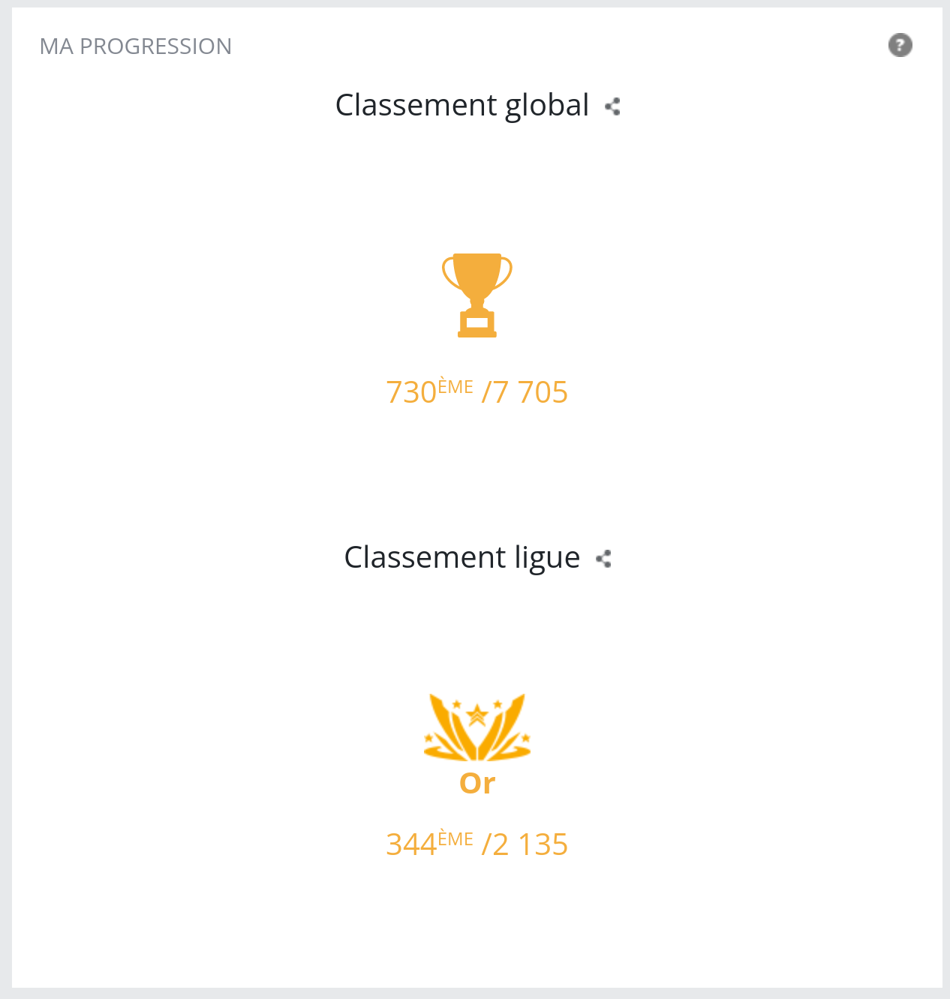

# CodinGame
A repo containing my participation on multiple codingames challenges.
CodinGame is a website with multiple coding exercices, where you can solve mathematical equations, create bots and compete against other players / coders.

CodinGame challenges are a seasonal event, lasting 10 days each where the registered player can create bots that will fight against other players bots. This usually involve some resource management (e.g. mana), good coding practices (or at least, your code must complete in a low time to be valid) and some mathematics if you want to be competitive (like calculate the future position of a moving object, the probability that the ennemy player can do an action, etc).

I'm more ops than dev, but I still like those kind of challenges as the entry bar is still low, and everyone can compete at their level.

I'll update this repo only once the challenge is completed.

## Results from previous challenges

### CodinGame Spring Challenge 2022
Finished 730th / 7 705 on Gold league.
Code: [Spring Challenge 2022](./spring-challenge-2022/README.md)

### CodinGame Spring Challenge 2021

Finished 756th / 6 867 on Gold league.
Code : [Spring Challenge 2021](./spring-challenge-2021/README.md)

## Other informations
[How to start a new game](./new_game.md)
